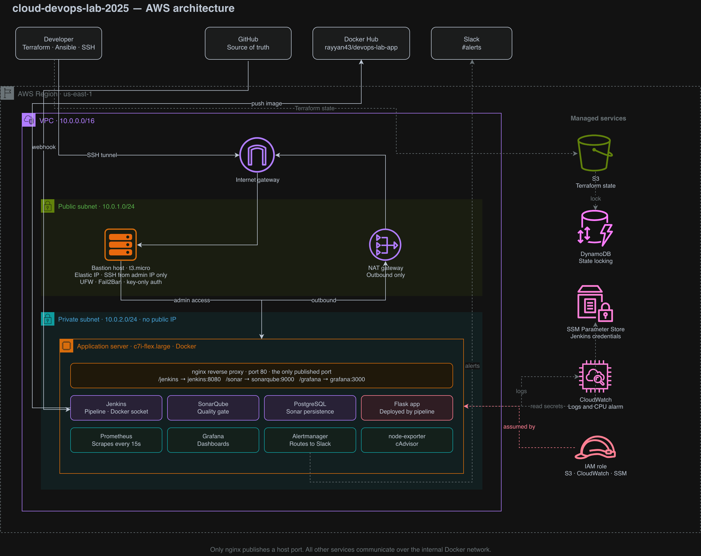

# cloud-devops-lab-2025

A small production-shaped DevOps environment on AWS: infrastructure as code, configuration
management, a containerised CI/CD toolchain, and monitoring with alerting.

A minimal Flask application is built, tested, analysed, published and deployed by a Jenkins
pipeline running entirely inside a private subnet.



---

## Contents

- [What this builds](#what-this-builds)
- [Repository layout](#repository-layout)
- [Prerequisites](#prerequisites)
- [Setup](#setup)
  - [1. Terraform state backend](#1-terraform-state-backend)
  - [2. Infrastructure](#2-infrastructure)
  - [3. Configuration with Ansible](#3-configuration-with-ansible)
  - [4. Tool stack](#4-tool-stack)
  - [5. Jenkins](#5-jenkins)
  - [6. Monitoring](#6-monitoring)
- [Accessing the services](#accessing-the-services)
- [The pipeline](#the-pipeline)
- [Secrets](#secrets)
- [Cost control](#cost-control)
- [Teardown](#teardown)
- [Further documentation](#further-documentation)

---

## What this builds

| Layer | Tool | Result |
|-------|------|--------|
| Infrastructure | Terraform | VPC, subnets, gateways, two EC2 instances, IAM, CloudWatch |
| Configuration | Ansible | Docker, hardened SSH, `devops` user, UFW, Fail2Ban |
| Runtime | Docker Compose | Jenkins, SonarQube, PostgreSQL, Prometheus, Grafana, nginx |
| Delivery | Jenkins | Build, lint, test, scan, publish, deploy, smoke test |
| Observability | Prometheus, Grafana, Alertmanager, CloudWatch | Dashboards, alert rules, Slack notifications |

The application server sits in a private subnet with no public IP. It reaches the internet
outbound through a NAT gateway, and is administered exclusively through a bastion host whose
SSH port is open only to a single address.

---

## Repository layout

```
cloud-devops-lab-2025/
├── terraform/
│   ├── bootstrap/          State bucket and lock table (local state, run once)
│   └── main/               VPC, subnets, EC2, IAM, SSM, CloudWatch
├── ansible/
│   ├── ansible.cfg
│   ├── inventory.ini       Bastion and app groups, ProxyCommand tunnel
│   ├── docker.yml          Docker, Compose plugin, Python
│   ├── hardening.yml       devops user, SSH hardening, UFW, Fail2Ban
│   ├── secrets.yml         Ansible Vault encrypted
│   ├── deploy-stack.yml    Ships compose and config files, starts services
│   └── cloudwatch.yml      CloudWatch agent for log forwarding
├── docker/
│   ├── docker-compose.yml
│   ├── nginx.conf          Reverse proxy: /jenkins, /sonar, /grafana
│   ├── prometheus.yml      Scrape configuration
│   ├── alerts.yml          Alert rules
│   └── alertmanager.yml    Slack receiver
├── app/
│   ├── app.py              Flask application with /health and /metrics
│   ├── Dockerfile
│   ├── requirements.txt
│   ├── .flake8
│   └── tests/test_app.py
├── docs/
│   ├── architecture-diagram.png
│   ├── operations-guide.md
│   └── decision-log.md
├── .github/ISSUE_TEMPLATE/
└── Jenkinsfile
```

---

## Prerequisites

- An AWS account with credentials configured (`aws configure`)
- Terraform >= 1.2
- Ansible
- An SSH key pair registered in EC2
- A Docker Hub account and access token
- Optionally, a Slack workspace for alert delivery

```bash
brew install terraform ansible awscli
```

**Accurate system time is required.** AWS rejects any API request signed more than five
minutes out of sync, and the resulting `SignatureDoesNotMatch` error does not mention the
clock. Verify with `date -u` and enable automatic synchronisation before starting.

---

## Setup

### 1. Terraform state backend

State is stored remotely so it can be shared and locked. The bucket and lock table are created
from a separate directory using local state, because a configuration cannot create the bucket
it also stores its own state in.

```bash
cd terraform/bootstrap
terraform init
terraform apply
```

This creates an S3 bucket with versioning enabled and a DynamoDB table keyed on `LockID`.
Run once; it is not touched again.

### 2. Infrastructure

Update `terraform/main/variables.tf` before applying:

| Variable | Purpose |
|----------|---------|
| `region` | Deployment region, default `us-east-1` |
| `vpc_cidr` | VPC address range |
| `public_subnet_cidr` / `private_subnet_cidr` | Subnet ranges |
| `my_ip` | Your public IPv4 in CIDR form — the only address permitted to reach SSH |
| `key_name` | Name of an existing EC2 key pair |
| `enable_nat` | Toggle for the NAT gateway, the only always-billing resource |

Find your address with `curl -4 ifconfig.me`. The `-4` matters: on a dual-stack network the
default returns IPv6, which will not match an IPv4 security group rule.

Create the key pair if it does not exist:

```bash
aws ec2 create-key-pair --key-name devops-lab --region us-east-1 \
  --query 'KeyMaterial' --output text > ~/.ssh/devops-lab.pem
chmod 400 ~/.ssh/devops-lab.pem
ssh-keygen -y -f ~/.ssh/devops-lab.pem > ~/.ssh/devops-lab.pem.pub
```

Then:

```bash
cd terraform/main
terraform init
terraform plan
terraform apply
terraform output
```

`bastion_public_ip` is an Elastic IP and remains stable across stops, starts and instance
resizes. `app_private_ip` is only reachable from inside the VPC.

### 3. Configuration with Ansible

Put both output values into `ansible/inventory.ini`. The bastion address appears **twice** —
once as the host in the `[bastion]` group, and again inside the `ProxyCommand` string that
tunnels traffic to the private instance. Updating only one is the most common cause of
`Connection timed out during banner exchange`.

Verify connectivity before running anything:

```bash
cd ansible
ansible all -m ping
```

Both hosts should return `pong`. Then, in order:

```bash
ansible-playbook docker.yml       # Docker, Compose plugin, Python
ansible-playbook hardening.yml    # devops user, SSH hardening, UFW, Fail2Ban
```

**Keep a second SSH session open while running `hardening.yml`.** It restarts the SSH daemon,
and the application server has no public IP — a malformed configuration would otherwise
require detaching and mounting its volume elsewhere to recover.

Confirm the hardening worked before closing that session:

```bash
ssh -i ~/.ssh/devops-lab.pem devops@<bastion_public_ip>
sudo ufw status
sudo fail2ban-client status
```

### 4. Tool stack

```bash
ansible-playbook deploy-stack.yml
```

This copies the Compose file and the nginx, Prometheus, alert and Alertmanager configs to
`/opt/tool-stack` on the application server, starts the containers, and installs the Docker
CLI inside the Jenkins container so the pipeline can build images.

Configuration files are **mounted**, not baked in. After editing anything in `docker/`, both
steps are required:

```bash
ansible-playbook deploy-stack.yml
ansible app -m shell -a "cd /opt/tool-stack && docker compose restart <service>" --become
```

The first ships the file; the second makes the service re-read it.

### 5. Jenkins

Open a tunnel from your machine:

```bash
ssh -f -N -o ServerAliveInterval=30 \
  -L 8080:<app_private_ip>:80 \
  -i ~/.ssh/devops-lab.pem ubuntu@<bastion_public_ip>
```

Then browse to `http://localhost:8080/jenkins`. Retrieve the unlock key with:

```bash
ansible app -m shell -a \
  "docker exec tool-stack-jenkins-1 cat /var/jenkins_home/secrets/initialAdminPassword" --become
```

Install the suggested plugins, create an admin user, then add two more under
**Manage Jenkins → Plugins**: **Prometheus metrics** and **SonarQube Scanner**.

**Credentials.** Under **Manage Jenkins → Credentials → System → Global** — not the
user-scoped store, which pipelines cannot reliably read:

| ID | Kind | Value |
|----|------|-------|
| `dockerhub` | Username with password | Docker Hub username and access token |
| `sonar-token` | Secret text | Token from SonarQube → My Account → Security |

**Job.** New Item → Pipeline → *Pipeline script from SCM* → Git → this repository → branch
`*/main` → script path `Jenkinsfile`.

### 6. Monitoring

Grafana is at `http://localhost:8080/grafana`, default credentials `admin` / `admin`.

Add the data source first — **Connections → Data sources → Prometheus**, URL
`http://prometheus:9090`. Panels render empty until this tests green.

Then **Dashboards → New → Import** and enter `1860` (Node Exporter Full). This covers host
CPU, memory, disk and network.

For Jenkins metrics, create a dashboard with a Prometheus query on
`default_jenkins_builds_last_build_duration_milliseconds`. Note the `default_` prefix — it is
added by the plugin and is easy to miss.

CloudWatch log forwarding is applied separately:

```bash
ansible-playbook cloudwatch.yml
```

This works without any credentials on the instance; the agent authenticates using the IAM
instance profile attached by Terraform.

---

## Accessing the services

Nothing is exposed to the internet. All access is through an SSH tunnel via the bastion, so
the services are reachable only by someone holding the private key and connecting from the
permitted address.

| Service | URL through the tunnel |
|---------|------------------------|
| Jenkins | `http://localhost:8080/jenkins` |
| SonarQube | `http://localhost:8080/sonar` |
| Grafana | `http://localhost:8080/grafana` |

The tunnel lives only as long as its SSH process. `-f -N` runs it in the background with no
shell, so there is no terminal window to close by accident. To stop it:

```bash
pkill -f "8080:<app_private_ip>"
```

---

## The pipeline

```
Checkout → Build image → Lint → Test → SonarQube → Push → Deploy → Smoke test
```

| Stage | What it does |
|-------|--------------|
| Checkout | Clones the repository |
| Build image | `docker build`, tagged with the build number and `latest` |
| Lint | flake8, run inside the image just built |
| Test | pytest, run inside the image just built |
| SonarQube | Static analysis; the quality gate can fail the build |
| Push | Publishes both tags to Docker Hub using a stored credential |
| Deploy | Replaces the running application container |
| Smoke test | `curl -f /health` against the deployed container |

Any stage failing aborts everything after it, so untested code cannot reach Docker Hub and a
broken image cannot reach deployment. Cheap checks run before expensive ones.

Lint and test run **inside the built image** rather than in a separately assembled environment.
This means the artifact that passes the tests is byte-for-byte the artifact that gets deployed,
and Jenkins itself needs no language runtimes installed.

A `post` block prunes dangling images after every run, without which the disk fills steadily.

---

## Secrets

Nothing sensitive is committed. Three mechanisms, each for a different case:

**IAM instance profile** — the application server calls AWS with automatically rotated
temporary credentials. No key file exists on disk to leak.

**SSM Parameter Store** — values that never enter the repository at all. Terraform creates the
parameters with a `lifecycle` block ignoring their contents; real values are written separately
with the AWS CLI so they stay out of both the code and the state file.

**Ansible Vault** — `ansible/secrets.yml` is encrypted and safe to commit. The vault password
itself lives in `.vault_pass`, which is git-ignored and never leaves the machine.

The Slack webhook in `docker/alertmanager.yml` is a placeholder in version control. Substitute
a real URL at deploy time; a webhook URL grants anyone holding it the ability to post to the
channel and should be treated as a credential.

---

## Cost control

The NAT gateway bills continuously at roughly $0.045/hour with no stopped state. It is the
single largest cost in an idle environment. Destroy it between sessions:

```bash
terraform apply -var enable_nat=false
```

Stopped EC2 instances cost nothing for compute — only their EBS volumes, at a few cents per
day. Stop both instances whenever you are not actively working.

CloudWatch log groups retain data indefinitely by default. This project sets seven days.

---

## Teardown

```bash
cd terraform/main
terraform destroy
```

The bootstrap directory is deliberately left standing so that destroying the infrastructure
never removes the bucket holding its own state. Remove it separately, and only when finished
entirely:

```bash
cd ../bootstrap
terraform destroy
```

Docker Hub images are not managed by Terraform and must be deleted through the Docker Hub
interface if no longer wanted.

---

## Further documentation

- **[docs/operations-guide.md](docs/operations-guide.md)** — day-to-day operation,
  monitoring, and a troubleshooting reference covering every failure encountered during the
  build.
- **[docs/decision-log.md](docs/decision-log.md)** — why each tool and pattern was chosen,
  including the alternatives rejected and the constraints that forced certain choices.